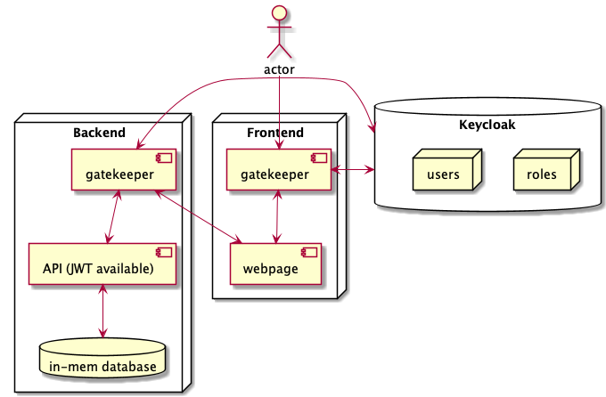

# 🧨 rooijakkers.software.full-stack

Frontend and backend for vending machine.

## 📋 Prerequisites

- java
- lein
- npm

## 🚀 Build and start

```sh
make
```
## 🔥 Visit

Navigate to [localhost:8080][1] for the frontend.

## 🏗 Build

```sh
make build
```

## 🏃 Run

```sh
make run
```

## 📖 Documentation

- [Frontend](frontend/README.md)
- [Backend](backend/README.md)

### 📐 Component diagram



<sub><sup>Diagram generated from
[doc/component-diagram.puml](doc/component-diagram.puml) using
[PlantUML][2]</sup></sub>

[1]: http://localhost:8080
[2]: https://plantuml.com
